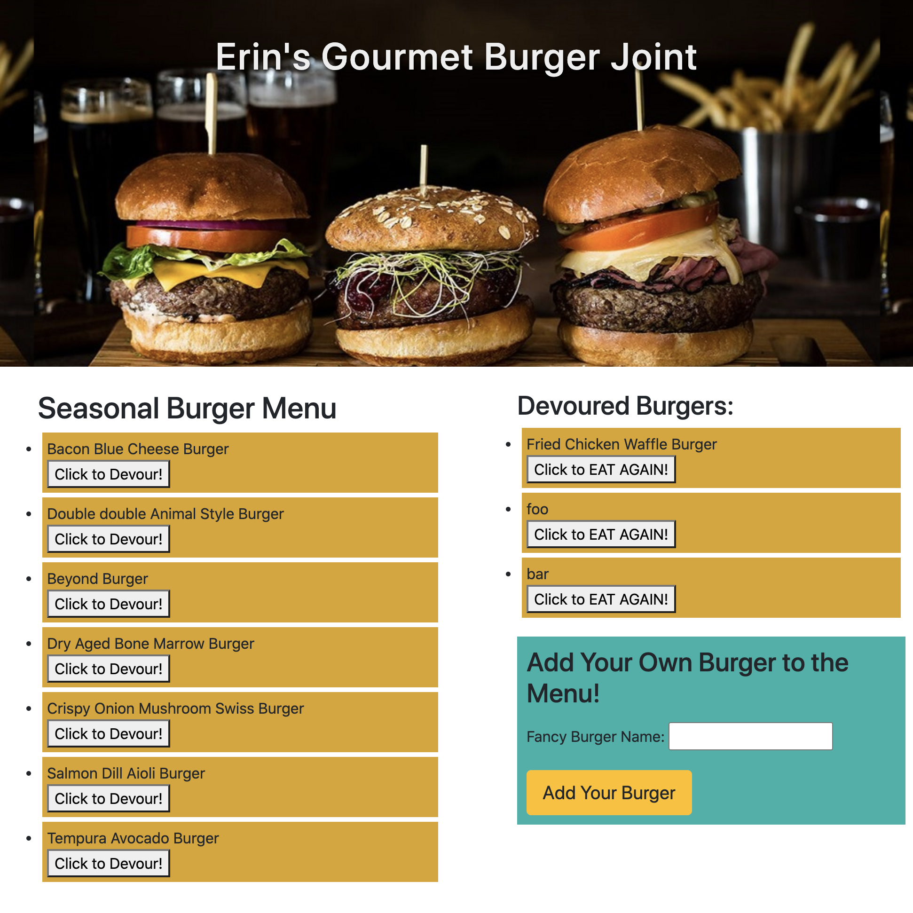

# burger

## Description
Erin's Gourmet Burger Joint, or "burger", is a playful restaurant app that lets users interact with a burger menu and create/display burgers that they would like to eat, as well as "devour them".

The app is a burger menu/builder/logger site created with MySQL, Node, Express, Handlebars and an ORM. It follows the MVC design pattern, stores burgers in a database, and is deployed on Heroku!  Node and MySQL query the route data, and Handlebars generates the HTML.

[Link to Heroku](https://frozen-harbor-42097.herokuapp.com/)
[Link to project](https://erin-smith.github.io/burger/)
  

## Table of Contents
* [Installation](#Installation)
* [Usage](#Usage)
* [License](#License)
* [Contributing](#Contributing)
* [Tests](#Tests)
* [Questions](#Questions)
 
 
## Installation 
   
No installation needed.  Simply go to the live links here:
[Link to Heroku](https://frozen-harbor-42097.herokuapp.com/)
[Link to Github](https://erin-smith.github.io/burger/)

  

If you are still curious about installation...
To install the program, one would clone the repository and open in Visual Studio Code.  Then run the following command(s):
`npm install`  

To install necessary dependencies, run the following command(s):  
`npm install express`  
`npm install express-handlebars`  
`npm install mysql`

You'll need to run the schema and seeds files in MySQL Workbench.

To invoke the program, right click the server.js file, open the terminal and run the command:
`npm start` 

Then navigate to the local host port notated in the console and watch the magic happen. 

## Usage 
  Simply visit the link on Heroku to use.
  [Link to project](https://frozen-harbor-42097.herokuapp.com/)
  
  Erin's Gourmet Burger Joint, or "burger", displays a classy burger menu.  It's an app that lets users input the names of burgers they'd like to eat.  Whenever a user submits a burger's name, the app displays the burger name. The user can "Click to Devour" to inhale a delicious burger. They can "Click to Eat Again" if they want to move a buger back to the starter menu to make available again. 

## License 

  This project is licensed under the ISC license. 

## Contributing   
 If you would like to contribute to this project or have feedback, please contact me below in the Questions Section.
***
 **Contributors:** erin-smith   
***

 

## Tests 

  To run tests, I ran nodemon, --inspector, VSdebugger, used any console.logs, throw errors, validations, and checked the code via localhost/Chrome inpector, Github and Heroku functionality.

## Questions:  
  

  If you have any questions about the repo, [open an issue](https://github.com/erin-smith/burger/issues/new) or contact me:  

* [My GitHub Profile](http://github.com/erin-smith)
* 
***

